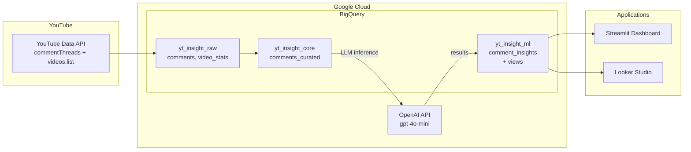
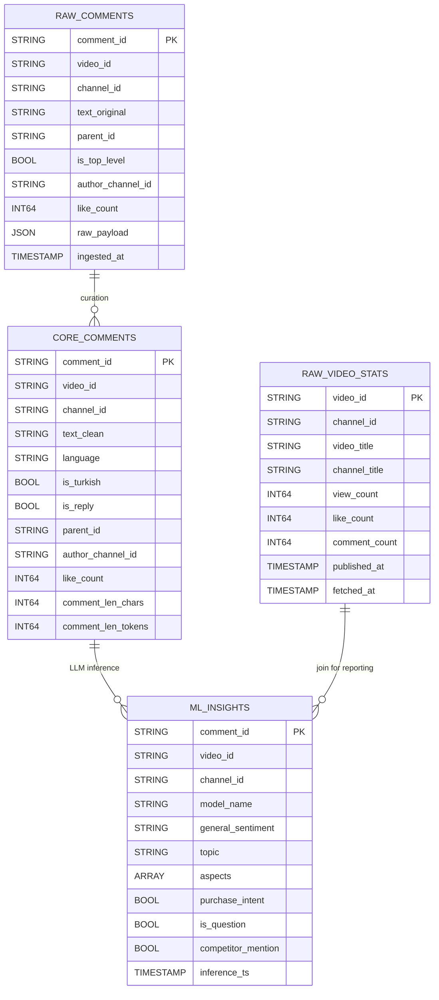
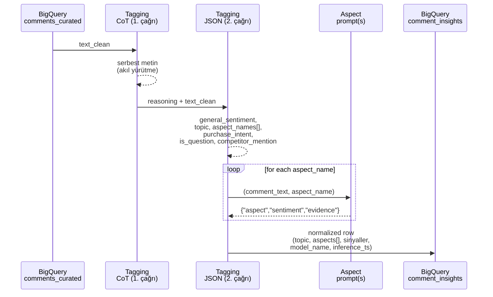

## YT Insight Hub – Teknik Mimari

Bu doküman, projeyi sistemi genelden özele doğru; veri akışı, LLM mimarisi ve şema tasarımı
ile birlikte netleştirmek amacıyla hazırlanmıştır.

---

## 1. Ürün fikri (high-level)

**YT Insight Hub**, YouTube teknoloji videoları altındaki yorumları:

- YouTube API’den çeker,
- BigQuery’de katmanlı bir şemaya yerleştirir (`raw → core → ml`),
- LLM ile her yorum için:
  - genel sentiment,
  - topic,
  - aspect bazlı sentiment + evidence,
  - stratejik sinyaller (satın alma niyeti, soru, rakip kıyası)
  üretir,
- Çıktıyı Streamlit dashboard ve Looker Studio raporları üzerinden sunar.

Bu, “conversational analytics” yaklaşımının YouTube yorum verisine uygulanmış,
uçtan uca çalışan bir mini ürünüdür.

### 1.1. Tasarım hedefleri ve kısıtlar

- **Tek kaynak, tek pipeline**  
  - Tüm verinin tek kaynağı YouTube Data API’dir; veri modeli, bu API’nin iki endpoint’ine (commentThreads, videos.list) göre tasarlanmıştır.  
  - Tüm işleme adımları (fetch → curate → inference → raporlama) tek, tekrar çalıştırılabilir bir pipeline olarak kurgulanmıştır.

- **Basit ama üretim-benzeri mimari**  
  - BigQuery dataset’leri klasik `raw / core / ml` pattern’i ile ayrılmıştır.  
  - Bu, CTO’ya “büyütülebilir bir iskelet” gösterirken, akademik tarafta da veri katmanlaştırma prensiplerini sergiler.

- **LLM’i “kontrollü extractor” olarak kullanmak**  
  - Serbest generatif çıktılardan kaçınmak; bunun yerine kapalı ontoloji (TOPICS, ASPECTS) ve JSON output ile, LLM’i etiketleyici/özetleyici gibi kullanmak.  
  - Temperature düşük (varsayılan 0.0) tutulur; CoT + JSON schema ile deterministik davranış hedeflenir.

- **Maliyet / sadelik dengesi**  
  - Proje bir araştırma/MVP olduğundan, inference tarafında (özellikle CoT + per‑aspect çağrılar) maliyet optimizasyonu ikincil önceliktedir.  
  - Buna karşılık, kod tarafında gereksiz karmaşıklıktan kaçınmak ve temiz, okunabilir bir yapı korumak hedeflenmiştir.

---

## 2. Üst seviye mimari



**Notlar:**

- **Kaynak tek**: YouTube Data API üzerinden sadece `commentThreads` ve `videos.list`
  kullanılıyor; bu, veri modelini basit ve yeniden oynatılabilir kılıyor.
- **Depolama / compute**: BigQuery, hem veri ambarı hem de feature store görevi görüyor.
  Üç dataset (raw/core/ml) klasik DW pattern’i (staging → curated → marts) ile uyumlu.
- **LLM katmanı**: OpenAI `gpt-4o-mini`; sınıflandırma ve extraction için düşük temperature (varsayılan 0.0),
  kapalı label space (ontology), prompt chaining ve tagging için iki aşamalı Chain-of-Thought (CoT) ile kontrol altında tutuluyor.
- **Sunum katmanı**:
  - Streamlit: hızlı interaktif keşif ve debug için,
  - Looker: iş tarafına paylaşılabilir dashboard’lar için.

---

## 3. Pipeline akışı (Make komutları → veri katmanları)

```mermaid
flowchart TD
    A[make fetch-comments<br/>VIDEO_ID=...] --> B[yt_insight_raw.comments<br/>+ video_stats]
    B --> C[make curate-comments<br/>(curate_comments.py)]
    C --> D[yt_insight_core.comments_curated]
    D --> E[make run-inference<br/>VIDEO_ID=...<br/>(comment_insights.py)]
    E --> F[yt_insight_ml.comment_insights]
    F --> G[Views:<br/>comment_insights_report,<br/>aspect_sentiment_report,<br/>comment_ngrams]
    G --> H[make streamlit<br/>(frontend/app.py)]
```

**Teknik açıklama:**

- **`make fetch-comments`**  
  - YouTube API’den yorumlar (top-level + replies) ve video istatistiklerini çeker.
  - Çıktı: `yt_insight_raw.comments` ve `yt_insight_raw.video_stats`.
- **`make curate-comments`**  
  - Deterministik text cleaning:
    - HTML unescape, URL kaldırma, whitespace normalize,
    - Unicode NFC + Türkçe lowercasing (İ→i, I→ı),
    - langdetect ile `language` ve `is_turkish` flag’i,
    - `comment_len_tokens` gibi yardımcı metrikler.
  - Çıktı: `yt_insight_core.comments_curated`.
- **`make run-inference`**  
  - Prompt chaining ile LLM inference; tagging adımında iki aşamalı CoT (önce akıl yürütme, sonra JSON) kullanılır (ayrıntı Bölüm 5’te).
  - Çıktı: `yt_insight_ml.comment_insights`.
- **View katmanı**  
  - `comment_insights_report`: latest-run per comment; curated + video_stats join’li, Looker için.
  - `aspect_sentiment_report`: aspects dizisini satır satır açan view; aspect × sentiment analizi.
  - `comment_ngrams`: n-gram sayımları; kelime bulutu / sık ifadeler için.

Bu akışın tamamı `Makefile` üzerinden çağrılabiliyor; MVP için yeterli, gerektiğinde
Airflow / Cloud Composer gibi orkestratörlere taşınabilir.

---

## 4. BigQuery veri modeli (ER perspektifi)



**Öne çıkan noktalar:**

- **Raw katman**:
  - Ham API payload’ı (`raw_payload`) tutuluyor; gerektiğinde şema değişiklikleri veya
    yeniden curation yapılabiliyor.
- **Core katman**:
  - Analiz için normalize edilmiş text ve basit özellikler (dil, uzunluk, reply bilgisi).
  - LLM’e giden metin sadece `text_clean`; cleaning deterministik ve ucuz.
- **ML katmanı**:
  - `comment_insights` single-source-of-truth:
    - `model_name` ve `inference_ts` ile model versiyonları ve tekrar run’lar izlenebilir.
  - View’ler (`comment_insights_report`, `aspect_sentiment_report`) iş ve görselleştirme
    katmanı için optimize edilmiş, ancak ham ML çıktısı bozulmadan ayrı tutuluyor.

---

## 5. LLM mimarisi – Prompt chaining ve iki aşamalı CoT (v4)

### 5.1. Neden chaining?

- Tek bir büyük prompt ile:
  - topic, tüm aspect’ler, sentiment’ler, evidence’lar ve stratejik sinyaller istenirse,
  - modeli hem çok işi aynı anda yapmaya zorluyor,
  - hem de evidence kalitesi düşebiliyor.
- Chaining ile:
  - **STEP 1 (Tagging):** label space'i daraltmak (topic + aspect_names + sinyaller).
    - v4'te bu adım **iki aşamalı Chain-of-Thought (CoT)** ile yapılır: önce model "adım adım düşün" (serbest metin), sonra bu çıktı verilerek sadece JSON üretilir; topic/aspect kararlarının tutarlılığı artar.
  - **STEP 2 (Aspect):** her aspect için odaklı sentiment + evidence çıkarmak (tek JSON çağrısı per aspect).

### 5.2. Akış diyagramı



### 5.3. STEP 1 – Tagging: iki aşamalı CoT (topic + aspect_names + sinyaller)

- **Girdi**: `text_clean` (Türkçe yorum).
- **İki API çağrısı:**
  1. **Aşama 1 – Akıl yürütme (CoT):**
     - Aynı sistem prompt (topic/aspect listesi ve kurallar) kullanılır; kullanıcı mesajında yorum verilir ve "adım adım analiz et" istenir (ana konu, hangi aspect'ler, genel duygu, satın alma niyeti/soru/rakip).
     - `response_format` kullanılmaz; model serbest metin (Türkçe/İngilizce) döner. Bu çıktı `_call_text_model()` ile alınır.
  2. **Aşama 2 – JSON:**
     - Konuşma: [system, user_cot, assistant_reasoning, user "Yukarıdaki analize göre sadece şu JSON anahtarlarını üret"].
     - `response_format={"type": "json_object"}` ile yalnızca istenen alanlar istenir.
- **Nihai çıktı** (2. çağrıdan):
  - `general_sentiment ∈ {positive, negative, neutral, mixed}`
  - `topic ∈ TOPICS` (kapalı ontoloji).
  - `aspect_names: List[str]` (`ASPECTS` ontolojisinden isimler).
  - `purchase_intent`, `is_question`, `competitor_mention` (boolean).
- **Talimatlar** (sistem prompt'ta, İngilizce + Türkçe örnekli):
  - Aspect için sadece isim; sentiment/evidence bu adımda yok.
  - Aspect mapping: "sd kart, depolama, GB → storage", "servis, garanti → customer_service" vb.
  - JSON'da `aspect_names` her zaman dizi.

### 5.4. STEP 2 – Aspect prompt (sentiment + evidence, per aspect)

- **Girdi**:
  - Yorum metni,
  - Tek bir `aspect_name`.
- **Çıktı**:
  - `{"aspect": name, "sentiment": "positive|negative|neutral|mixed", "evidence": "<quote>"}`.
- **Kurallar**:
  - Sadece verilen aspect’e odaklan; diğer konuları yok say.
  - Belirsizse `neutral`; aynı aspect için hem olumlu hem olumsuz ifade varsa `mixed`.
  - Evidence asla boş değil; yoksa
    `"(aspect ile ilgili açık ifade yok)"` fallback’i kullan.

### 5.5. Kod seviyesi yapı

- API çağrı yardımcıları:
  - `_call_text_model(client, messages)` → serbest metin (CoT 1. aşama; `response_format` yok).
  - `_call_json_model(client, messages)` → JSON parse + retry (2 deneme); CoT 2. aşama ve aspect için.
- Tagging (iki aşamalı CoT):
  - `call_tagging_model(client, comment_text)`:
    - CoT mesajları: `_build_tagging_cot_user_prompt(comment_text)` ile ilk user mesajı, aynı system prompt.
    - 1. çağrı: `_call_text_model` → reasoning (serbest metin).
    - 2. çağrı: `build_tagging_messages_with_cot(comment_text, reasoning)` ile [system, user_cot, assistant, user "sadece JSON üret"] → `_call_json_model` → tagging dict.
- Aspect:
  - `call_aspect_model(client, comment_text, aspect_name)`:
    - `build_aspect_messages` ile mesajları kurar.
    - Aspect-specific dict döner.
- Birleştirme (özet):

```python
tagging = call_tagging_model(oa_client, text)
aspect_names = ...  # temizlenmiş, uniq liste
aspects = []
for name in aspect_names:
    aspect_pred = call_aspect_model(oa_client, text, name)
    aspects.append({
        "aspect": aspect_pred.get("aspect") or name,
        "sentiment": aspect_pred.get("sentiment"),
        "evidence": aspect_pred.get("evidence"),
    })
combined_prediction = dict(tagging)
combined_prediction["aspects"] = aspects
row = build_bq_row(row, combined_prediction, model_name)
```

- `build_bq_row`:
  - Topic ve aspect değerlerini ontolojiye normalize eder (`normalize_topic`, `normalize_aspect`),
  - Sentiment alanlarını set dışına düşerse `neutral`’a çeker,
  - Boolean alanları `"true"/"1"/"yes"/"evet"` gibi string’lerden bool’a dönüştürür,
  - Evidence boşsa `"(alıntı yok)"` ile doldurur,
  - `inference_ts` ile zaman damgası ekler.

Bu yapı, hem **kontrollü label space** (ontology + alias) hem de
**deterministik inference** (temperature=0.0, JSON output) ile birlikte,
LLM’i mümkün olduğunca “güçlü ama tahmin edilebilir bir extractor” gibi
konumlandırmayı hedefliyor.

---

## 6. Ontoloji ve “other” yönetimi

```mermaid
flowchart LR
    RAWL[LLM raw labels<br/>(topic, aspect)] --> NORM[normalize_topic / normalize_aspect]
    NORM -->|known| FINAL[Canonical labels<br/>TOPICS / ASPECTS]
    NORM -->|alias| ALIAS[Alias map<br/>("ses"→audio,<br/>"sd kart"→storage)]
    ALIAS --> FINAL
    NORM -->|unknown| OTHER["topic=offtopic<br/>veya<br/>aspect=other"]
```

- Tüm topic/aspect seti **tek yerde** tanımlı: `backend/inference/ontology.py`.
- Alias’lar (örn. `fiyat_performans`, `ses`, `wifi`, `sd kart`, `servis`) bu dosyada
  canonical isimlere map ediliyor.
- `docs/ONTOLOGY.md` ontolojiyi iş diliyle anlatıyor;
  `docs/MODEL_VERSIONS.md` ise v1–v4 boyunca yapılan değişiklikleri kaydediyor.

Bu sayede:

- LLM çıktısı ne üretirse üretsin, downstream tarafında her zaman
  **dar ve tahmin edilebilir bir label uzayı** var.
- “other” oranı, ontolojinin yeterliliğini ölçmek için doğal bir kalite metriği
  haline geliyor; gerektiğinde yeni aspect’ler (ör. `storage`, `customer_service`) eklenerek
  bu alan daraltılabiliyor.

---

## 7. Tasarım tercihleri ve trade-off’lar (CTO / akademik perspektif)

### 7.1. Neden BigQuery + Python, ayrı bir orkestratör yerine?

- **BigQuery avantajları:**
  - Sorgu dili SQL, ekipler için zaten bilinen bir araç; join ve view tanımlarıyla veri modelini açıkça ifade eder.  
  - `raw/core/ml` dataset ayrımı, hem veri bilimi (feature store, tekrar oynatma) hem de raporlama için klasik bir DW yaklaşımıdır.
- **Python script + Make yerine Airflow?**
  - Bu proje MVP/araştırma amaçlı olduğundan, operasyonel karmaşıklığı düşük tutmak için:
    - Her adım tek bir Python modülüdür (`fetch_youtube_comments`, `curate_comments`, `comment_insights`).  
    - Orkestrasyon, CI/CD veya cron tarafından çağrılabilecek basit `make` hedefleri ile yapılır.
  - CTO açısından: Gerektiğinde bu adımlar kolayca Airflow/Cloud Composer DAG’lerine taşınabilir; fonksiyon sınırları ve BigQuery arayüzleri buna göre tasarlanmıştır.

### 7.2. Neden iki aşamalı CoT, tek büyük prompt değil?

- **Tek prompt (tüm işi bir anda yap)** denendiğinde:
  - Topic, tüm aspect’ler, sentiment’ler, evidence’lar ve stratejik sinyaller aynı anda isteniyordu.  
  - Bu, modelin attention’ını zayıflatıp özellikle **aspect‑specific evidence** kalitesini düşürdü (örn. yanlış cümleden alıntı yapma).
- **İki aşamalı yaklaşımın faydaları:**
  - STEP 1’de model sadece **etiket alanını** daraltır (topic + aspect_names + sinyaller).  
  - STEP 2’de her aspect için ayrı çağrı, sadece o aspect’e odaklanır; bu, daha temiz ve yorumlanabilir evidence üretir.
- **Ek olarak, CoT katmanı:**
  - STEP 1’de, önce serbest “düşünme” (CoT) cevabı alınıp, ardından JSON istenir.  
  - Bu, özellikle “ürün değerlendirmesi mi, sponsorluk güveni mi?” gibi ince ayrımlarda daha tutarlı topic/aspect seçimleri sağlar.

### 7.3. Neden `mixed` sentiment sınıfı?

- Gerçek kullanıcı yorumları sıklıkla “karma”dır:
  - Örn. “Kamerası çok iyi ama fiyatı uçuk” → aynı yorumda hem pozitif hem negatif signal.  
  - Sadece `positive/negative/neutral` ile bu nüans kaybolur; neutral “ne olumlu ne olumsuz” ile “hem olumlu hem olumsuz”u karıştırır.
- Çözüm:
  - Genel sentiment için dörtlü bir skala: `positive / negative / neutral / mixed`.  
  - Aspect seviyesinde de aynı set desteklenir; böylece hem “karışık ürün deneyimi” hem de “karışık aspect” ayrı ayrı ifade edilebilir.
- Trade‑off:
  - Dashboard ve raporlama tarafında bir sentiment seviyesi daha yönetilmesi gerekir, ancak iş tarafına sunulan içgörü (özellikle şikâyet/övgü ayrımı) daha zengin hale gelir.

### 7.4. Neden ontoloji + normalizasyon bu kadar merkezi?

- **Tek kaynaklı sözlük:**  
  - Topic/aspect değerleri tek yerde (`ontology.py`) tutulur; prompt, normalizasyon fonksiyonları ve raporlama bunu paylaşır.  
  - Bu, isim drift’ini engeller (örn. `channel_quality` yerine her yerde `channel_trust` kullanımı).
- **Alias haritaları:**  
  - Eğitim/deneme sırasında farklı isimler (örn. `ses`, `wifi`, `fiyat_performans`) gözlendi; alias sözlüğü bu varyantları canonical forma map eder.  
  - Böylece LLM’den gelen “garip ama anlamlı” etiketler veri ambarında normalize edilmiş olarak saklanır.

### 7.5. Idempotency, tekrar çalıştırma ve versiyonlama

- **Idempotent fetch/curate/inference:**
  - `fetch_youtube_comments`: `raw.comments`’ta `comment_id` bazında yeni satırları ekler; tekrar çalıştırma önceki veriyi bozmaz.  
  - `curate_comments`: `LEFT JOIN curated` ile sadece henüz curated olmayan raw satırları işler.  
  - `comment_insights`: `LEFT JOIN comment_insights` + `model_name` filtresiyle, aynı model için zaten işlenmiş yorumları atlar.
- **Versiyonlama:**
  - `model_name` ve `inference_ts`, hem hangi modelin kullanıldığını hem de son run zamanını izlemeyi sağlar.  
  - `comment_insights_report` view’i, aynı yorum için her zaman **son run**’ı (max `inference_ts`) seçer; böylece yeni prompt/model denemeleri doğal şekilde devreye girer.

### 7.6. Sınırlar ve gelecekteki geliştirmeler

- **Şu an yapılmayanlar:**
  - Online/streaming inference (pipeline batch odaklıdır).  
  - Gelişmiş eval pipeline’ı (gold labels + metrikler) bu repodan ayrılmıştır; sadece production‑benzeri inference akışı bırakılmıştır.
- **Gelecek için açık kapılar:**
  - Farklı LLM sağlayıcıları veya model versiyonları için `model_name` üzerinden A/B karşılaştırma.  
  - Daha gelişmiş intent sınıfları (örn. churn risk, upsell intent) için ek boolean/çoklu label alanları.  
  - Airflow/Cloud Composer DAG’leriyle zamanlanmış, hata toleranslı pipeline’lar.
